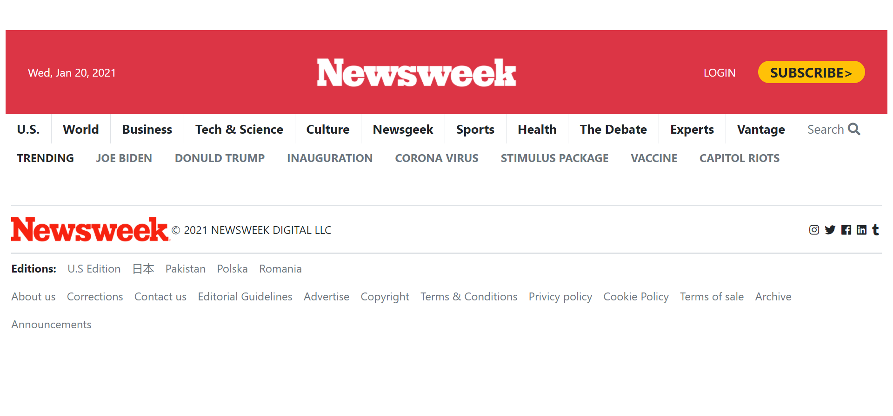

# Project-3-Newsweek

> Project 3: Using Bootstrap
The goal of the project is to build a clone of Newsweek website with Bootstrap CSS framework

Project requirements included using semantic HTML, Bootstrap CSS and Media Queries with 2 breakpoints.

## Built With

- HTML5
- Bootstrap
- CSS3 Media Queries

## Live Demo

[Live Demo Link](https://zeenatlawal.github.io/Project-3-Newsweek/)

## Authors

👤 **Zeenat Lawal**

- GitHub: [@ZeenatLawal](https://github.com/ZeenatLawal)
- Twitter: [@lawal_zeenat](https://twitter.com/lawal_zeenat)
- LinkedIn: [Zeenat Lawal](https://www.linkedin.com/in/zeenat-lawal-665872120/)

👤 **Safa Aballagh**

- GitHub: [@Safafa](https://github.com/safafa)
- Twitter: [@Aballagh_S](https://twitter.com/Aballagh_S)
- LinkedIn: [Aballagh Safa](https://www.linkedin.com/in/aballaghsafa/)

## 🤝 Contributing

Contributions, issues, and feature requests are welcome!

Feel free to check the [issues page](https://github.com/ZeenatLawal/Project-3-Newsweek/issues/1).

## Show your support

Give a ⭐️ if you like this project!